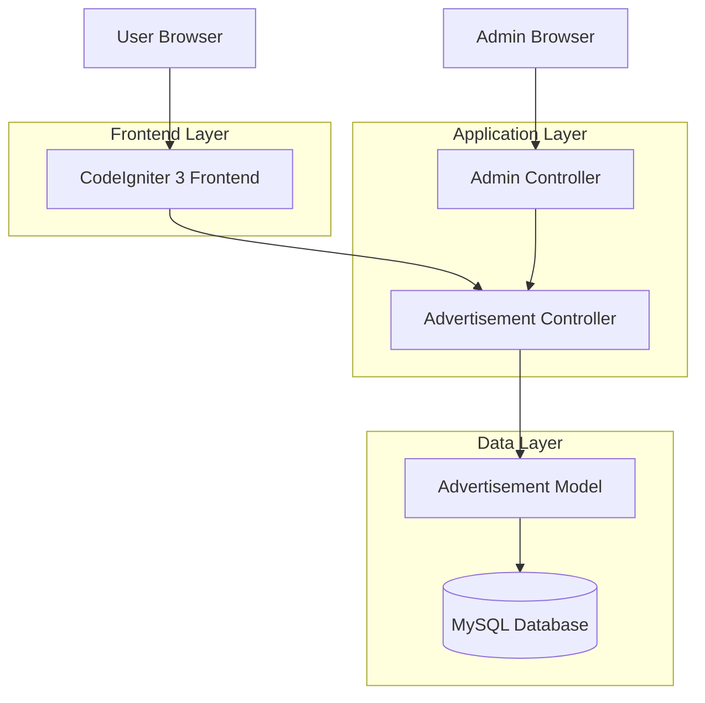
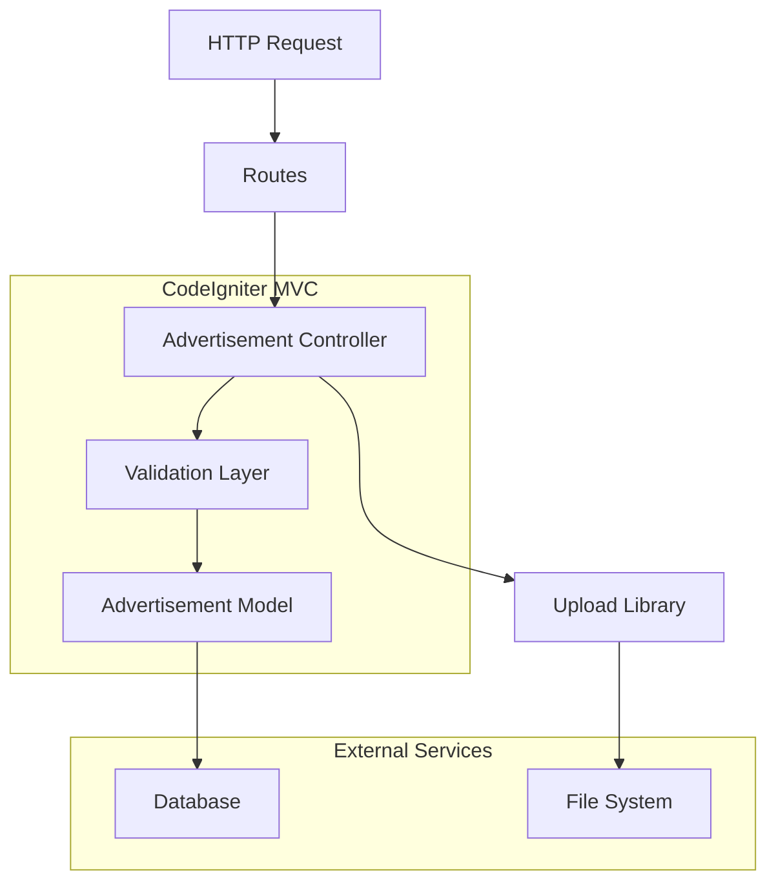
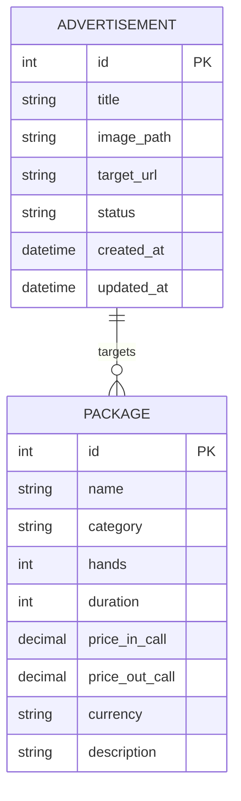

## 1. Architecture design



## 2. Technology Description

- **Frontend**: CodeIgniter 3 + Bootstrap + jQuery
- **Backend**: CodeIgniter 3 (MVC Pattern)
- **Database**: MySQL 5.7+
- **File Upload**: CodeIgniter Upload Library
- **Image Processing**: GD Library/ImageMagick

## 3. Route definitions

| Route | Purpose |
|-------|---------|
| / | Home page dengan advertisement popup |
| /admin/advertisements | Admin list iklan |
| /admin/advertisements/create | Form tambah iklan baru |
| /admin/advertisements/edit/{id} | Form edit iklan |
| /admin/advertisements/delete/{id} | Hapus iklan |
| /admin/advertisements/toggle/{id} | Toggle status aktif/non-aktif |
| /admin/advertisements/upload | Handle upload gambar |

## 4. API definitions

### 4.1 Advertisement Management API

#### Get Active Advertisement
```
GET /api/get-active-ad
```

Response:
```json
{
  "id": 1,
  "title": "Promo Paket Spa",
  "image_url": "/assets/uploads/advertisements/promo1.jpg",
  "target_url": "/booking?package_id=1&promo=1",
  "status": "active",
  "created_at": "2024-01-15 10:00:00"
}
```

#### Create Advertisement
```
POST /admin/advertisements/create
```

Request Parameters:
| Param Name | Param Type | isRequired | Description |
|------------|-------------|-------------|-------------|
| title | string | true | Judul iklan |
| image | file | true | File gambar iklan |
| target_url | string | true | URL tujuan saat iklan diklik |
| status | string | false | Status aktif/non-aktif |

## 5. Server architecture diagram



## 6. Data model

### 6.1 Data model definition



### 6.2 Data Definition Language

Tabel Advertisement (advertisements)
```sql
-- Membuat tabel untuk manajemen iklan
CREATE TABLE IF NOT EXISTS advertisements (
    id INT UNSIGNED AUTO_INCREMENT PRIMARY KEY,
    title VARCHAR(200) NOT NULL,
    image_path VARCHAR(255) NOT NULL,
    target_url VARCHAR(500) NOT NULL,
    status ENUM('active','inactive') NOT NULL DEFAULT 'active',
    created_at DATETIME NOT NULL DEFAULT CURRENT_TIMESTAMP,
    updated_at DATETIME NOT NULL DEFAULT CURRENT_TIMESTAMP ON UPDATE CURRENT_TIMESTAMP,
    INDEX idx_advertisement_status (status),
    INDEX idx_advertisement_created (created_at)
) ENGINE=InnoDB DEFAULT CHARSET=utf8mb4 COLLATE=utf8mb4_general_ci;

-- Insert data contoh
INSERT INTO advertisements (title, image_path, target_url, status) VALUES
('Promo Paket Spa Hemat', '/assets/uploads/advertisements/spa_promo_1.jpg', '/booking?package_id=1&promo=1', 'active'),
('Paket 4 Hands Special', '/assets/uploads/advertisements/4hands_promo.jpg', '/booking?package_id=5&promo=1', 'inactive');
```

## 7. File Structure

```
application/
├── controllers/
│   └── Admin.php (tambahan methods untuk advertisement)
├── models/
│   └── Advertisement_model.php
├── views/
│   ├── admin/
│   │   ├── advertisement_list.php
│   │   ├── advertisement_form.php
│   │   └── advertisement_preview.php
│   └── home.php (modifikasi untuk popup)
assets/
├── uploads/
│   └── advertisements/
├── js/
│   └── advertisement.js
└── css/
    └── advertisement.css
```

## 8. Security Considerations

- File upload validation: hanya gambar (jpg, jpeg, png, gif) dengan max size 2MB
- XSS protection pada semua input fields
- CSRF protection untuk semua form submissions
- SQL injection prevention menggunakan CodeIgniter query builder
- File path validation untuk mencegah directory traversal
- Session-based authentication untuk admin area