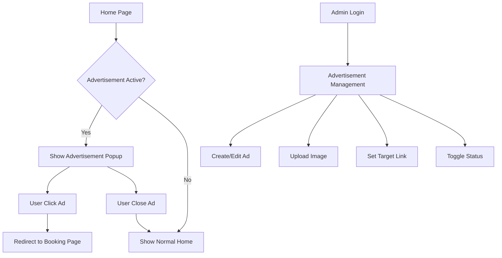

## 1. Product Overview
Sistem manajemen iklan popup untuk halaman home SPA booking system. Iklan akan muncul saat pengguna membuka halaman home pertama kali dan dapat dikelola oleh admin melalui panel admin.

Fitur ini memungkinkan admin untuk mempromosikan paket-paket tertentu dengan menampilkan gambar iklan yang menarik dan mengarahkan pengguna langsung ke halaman order paket promo tersebut.

## 2. Core Features

### 2.1 User Roles
| Role | Registration Method | Core Permissions |
|------|---------------------|------------------|
| Admin | Pre-defined account | Full CRUD access to advertisement management |
| Customer | Public access | View advertisements on homepage |

### 2.2 Feature Module
Sistem manajemen iklan terdiri dari halaman-halaman berikut:

1. **Home page**: Popup iklan yang muncul saat pertama kali dibuka
2. **Admin Advertisement List**: Daftar semua iklan yang dapat dikelola admin
3. **Admin Advertisement Form**: Form untuk menambah/mengedit iklan (upload gambar, setting link)
4. **Admin Advertisement Preview**: Preview iklan sebelum dipublish

### 2.3 Page Details
| Page Name | Module Name | Feature description |
|-----------|-------------|---------------------|
| Home page | Advertisement Popup | Modal popup menampilkan gambar iklan dengan tombol close dan call-to-action button yang mengarah ke halaman order paket promo |
| Admin Advertisement List | Advertisement Table | Tabel menampilkan daftar iklan dengan kolom: gambar (thumbnail), judul, status (aktif/non-aktif), tanggal dibuat, action buttons (edit, delete, toggle status) |
| Admin Advertisement Form | Form Tambah/Edit | Form upload gambar, input link URL tujuan, input judul iklan, checkbox status aktif/non-aktif, preview gambar sebelum submit |
| Admin Advertisement Preview | Preview Modal | Modal preview untuk melihat tampilan iklan sebelum disimpan |

## 3. Core Process

### Admin Flow
1. Admin login ke panel admin
2. Admin masuk ke halaman manajemen iklan
3. Admin dapat menambah iklan baru dengan upload gambar dan setting link
4. Admin dapat mengedit iklan yang sudah ada
5. Admin dapat menghapus iklan
6. Admin dapat mengubah status iklan (aktif/non-aktif)
7. Admin dapat preview iklan sebelum dipublish

### Customer Flow
1. Customer membuka halaman home
2. Popup iklan muncul secara otomatis (hanya sekali per session)
3. Customer dapat menutup popup dengan tombol close
4. Customer dapat klik gambar iklan untuk masuk ke halaman order paket promo
5. Customer diarahkan ke halaman booking dengan paket yang sudah dipilih

## 4. User Interface Design

### 4.1 Design Style
- **Primary Colors**: Warna tema yang sama dengan website SPA (gold/navy)
- **Secondary Colors**: Putih untuk background popup, hitam untuk overlay
- **Button Style**: Rounded corners dengan shadow efek
- **Font**: Sans-serif yang sama dengan website
- **Layout Style**: Modal popup centered dengan backdrop overlay
- **Image Style**: Responsive, max-width 100%, maintain aspect ratio

### 4.2 Page Design Overview
| Page Name | Module Name | UI Elements |
|-----------|-------------|-------------|
| Home page | Advertisement Popup | Modal dengan ukuran 800x600px, backdrop overlay gelap (opacity 0.8), tombol close di pojok kanan atas, gambar iklan full-width, animasi fade-in saat muncul |
| Admin Advertisement List | Data Table | Table dengan kolom: thumbnail gambar (100x100px), judul, status badge (hijau untuk aktif, merah untuk non-aktif), action buttons dengan icon, pagination jika banyak data |
| Admin Advertisement Form | Form Upload | Drag-and-drop area untuk upload gambar, preview gambar sebelum submit, input field untuk judul dan URL, checkbox untuk status, tombol submit dengan loading state |

### 4.3 Responsiveness
- Desktop-first design dengan breakpoint 768px untuk tablet dan 480px untuk mobile
- Popup iklan responsive: 90% width pada mobile, 80% pada tablet, 800px fixed pada desktop
- Touch interaction optimization untuk tombol close dan navigasi
- Image lazy loading untuk performa yang baik